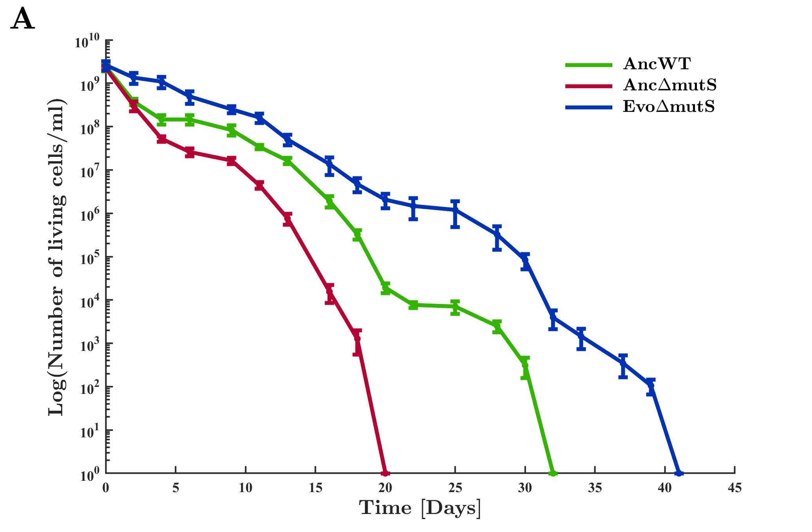

# M.Sc. in Biotechnology

Note : All computational work from my M.Sc thesis (all written in MATLAB)

## Abstract

Humanity’s quest to prolong life is as old as life itself. Since the ancient times, humans have sought ways to increase their lifespan, and over the recent decades, aging studies have gained traction in an attempt to solve this puzzle. In previous studies, genomic instability due to accumulation of DNA damage has been found to accelerate the cellular aging process and can even cause a shift towards programmed cell death. In microorganisms, there has been evidence that as a result of their elevated mutation rate, hypermutator strains have a lower viability than non-mutator wild-type strains. Still, the molecular mechanisms underlying extended viability remain elusive in hypermutators. In this study, we employed adaptive laboratory evolution on hypermutator _Escherichia coli_ cells to select for mutants with prolonged lifespan and lowered mutation rate under non-dividing stagnating conditions. Our results demonstrate that the hypermutator strain doubled its lifespan after evolution. This lifespan extension did not cause apparent trade-offs in cellular fitness. Interestingly, the evolved hypermutator cells ended up outliving the wild-type cells, and maintaining a milder death rate post evolution. Our mutation analysis revealed several genes associated with DNA repair under stress conditions, including _mdh_, _yidC_ and _spoT_. We have also identified a 32-fold deviation from the canonical mutation bias, favoring A:T to C:G transversion. Furthermore, our preliminary results have shown a 10-fold reduction in mutation rates of evolved populations. We suggest that hypermutator cells can extend their lifespan during evolution by inducing genetic and molecular mechanisms to compensate for their compromised DNA repair machinery. These findings may open up additional research avenues to elucidate mechanisms responsible for improved survival in various organisms, and may even be applicable for improving usages of beneficial microbes in biotechnology, medicine, food, and agriculture.

