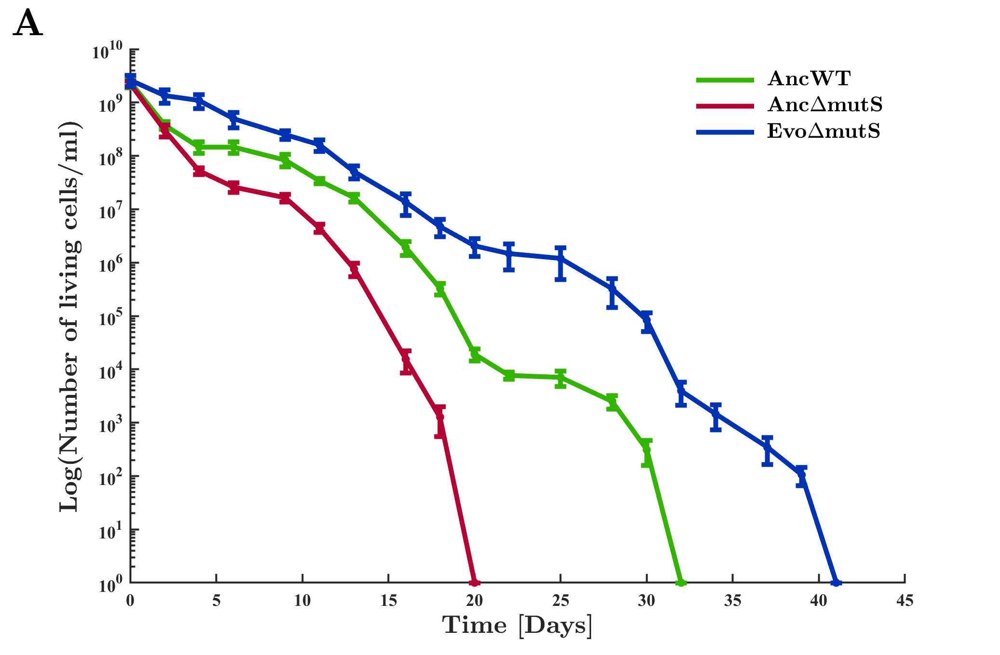
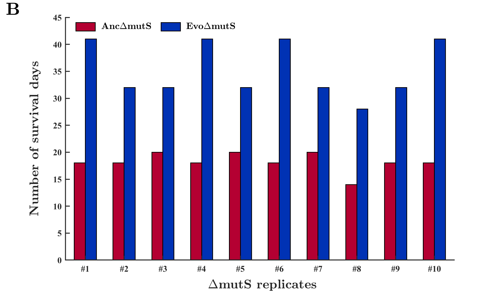
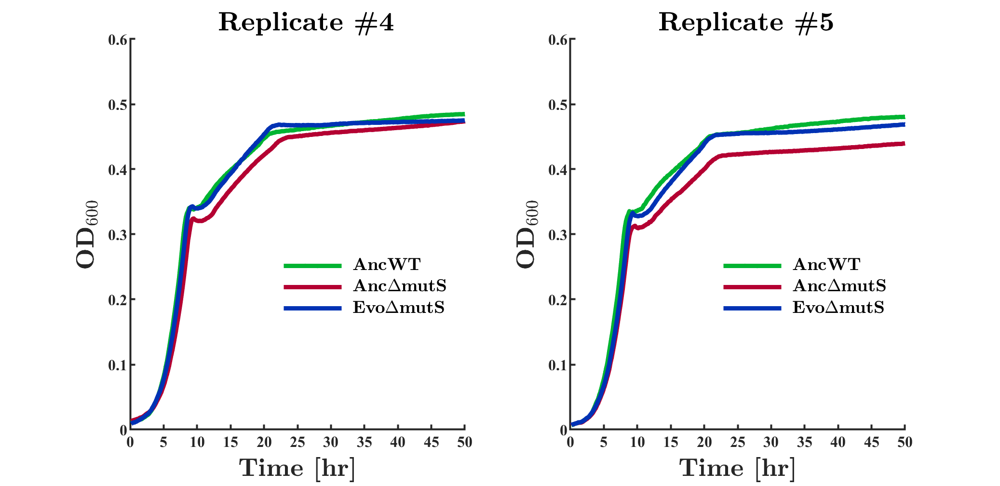
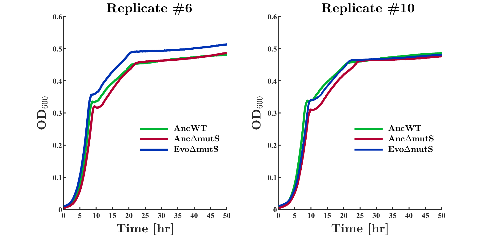
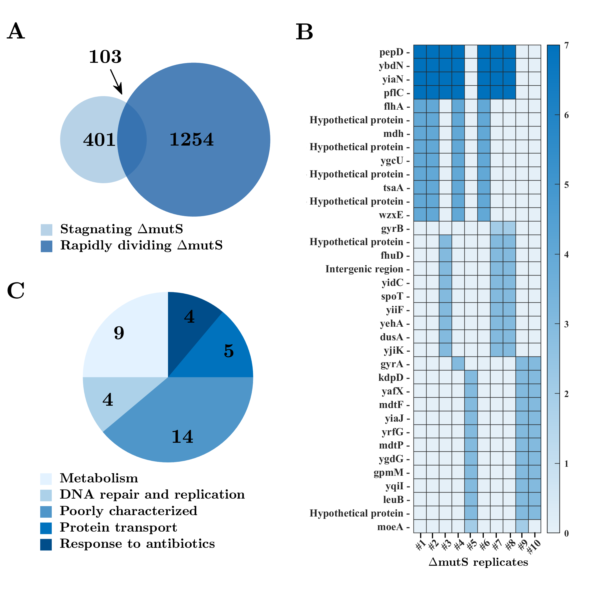
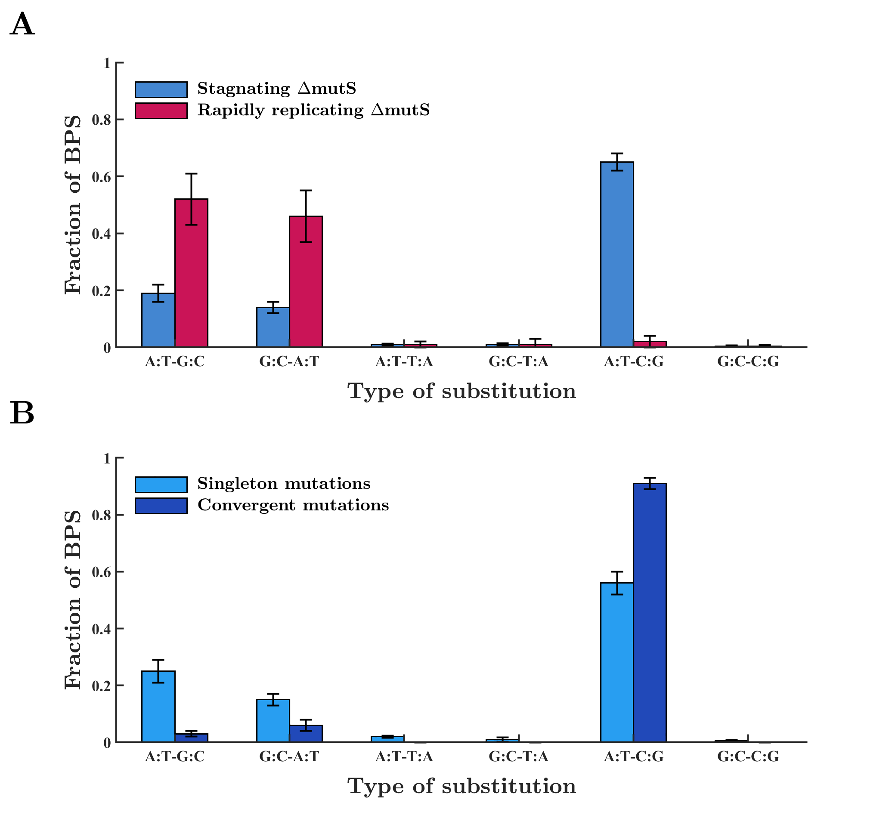
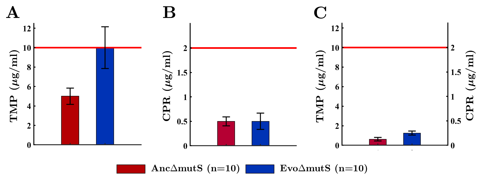

# M.Sc. in Biotechnology

## Abstract

Humanity’s quest to prolong life is as old as life itself. Since the ancient times, humans have sought ways to increase their lifespan, and over the recent decades, aging studies have gained traction in an attempt to solve this puzzle. In previous studies, genomic instability due to accumulation of DNA damage has been found to accelerate the cellular aging process and can even cause a shift towards programmed cell death. In microorganisms, there has been evidence that as a result of their elevated mutation rate, hypermutator strains have a lower viability than non-mutator wild-type strains. Still, the molecular mechanisms underlying extended viability remain elusive in hypermutators. In this study, we employed adaptive laboratory evolution on hypermutator _Escherichia coli_ cells to select for mutants with prolonged lifespan and lowered mutation rate under non-dividing stagnating conditions. Our results demonstrate that the hypermutator strain doubled its lifespan after evolution. This lifespan extension did not cause apparent trade-offs in cellular fitness. Interestingly, the evolved hypermutator cells ended up outliving the wild-type cells, and maintaining a milder death rate post evolution. Our mutation analysis revealed several genes associated with DNA repair under stress conditions, including _mdh_, _yidC_ and _spoT_. We have also identified a 32-fold deviation from the canonical mutation bias, favoring A:T to C:G transversion. Furthermore, our preliminary results have shown a 10-fold reduction in mutation rates of evolved populations. We suggest that hypermutator cells can extend their lifespan during evolution by inducing genetic and molecular mechanisms to compensate for their compromised DNA repair machinery. These findings may open up additional research avenues to elucidate mechanisms responsible for improved survival in various organisms, and may even be applicable for improving usages of beneficial microbes in biotechnology, medicine, food, and agriculture.

## Main Results

### Adaptive lab evolution (ALE) experiment resulted in a remarkable lifespan extension

**Figure 1**: Death curve analysis of ancestral and evolved strains.
**(A)** Death curves of AncWT, Anc&Delta;mutS and Evo&Delta;mutS strains. The AncWT strain survived for 32 days an ongoing starvation under stagnating conditions. The Anc&Delta;mutS strain remained viable for only 20 days and had an elevated death rate. The Evo&Delta;mutS strain doubled its lifespan and survived the stagnating conditions for a total of 41 days. **(B)** Number of survival days of each ancestral and evolved &Delta;mutS replicates. Despite the lifespan variation the Evo&Delta;mutS replicates have shown, all evolved replicates displayed a considerable lifespan increase relative to their corresponded ancestral replicates. Four replicates even able survived the stagnating conditions for 41 days, while their ancestors survived such conditions for only 18 days. 

### No apparent trade-offs in cellular fitness after lifespan extension

 **Figure 2**: Growth curves of chosen replicates of ancestral and evolved cells.
Cellular fitness, as measured by growth curves on minimal media, of &Delta;mutS strain did not change significantly after evolution. Moreover, some Evo&Delta;mutS replicates exhibited a higher growth rate than Anc&Delta;mutS cells, to a point where the growth of WT and the Evo$\Delta$mutS replicates were indistinguishable. 

### Mutation analysis of evolved strains

 **Figure 3**: Mutation analysis of Evo$\Delta$mutS replicates after ALE experiment.
**(A)** Comparing mutated genes obtained in our ALE experiment (stagnating cells) and in experiment involving rapidly growing &Delta;mutS cells. Out of the 401 mutated genes the Evo&Delta;mutS strain accumulated during stagnation, 103 genes were also mutated in rapidly dividing &Delta;mutS cells. Yet, statistical analysis shows that this gene intersection is not statistically significant, implying that the mutated genes obtained in the Evo&Delta;mutS strain are associated with survival under stagnating conditions. **(B)** 36 convergent genes mutated in multiple parallel replicates in Evo$\Delta$mutS strain, grouped by the number of occurrences of each mutated gene. **(C)** Description of some of the cellular functions the convergent mutated genes are involved in. 9 mutated genes are associated with metabolism _P value_ = 7.77 &times; 10-3), 4 genes are linked to DNA repair and replication _P value_ = 1.6 &times; 10-5), 5 genes are related to protein transport _P value_ = 1.5 &times; 10-2), 4 genes are involved in response to antibiotics _P value_ = 4.3 &times; 10-7), and 14 genes are uncharacterized.

 

### Isoleucine-to-Leucine mutation near the active site in Mdh

 **Figure 4**: Crystal structure of \*E. coli
8 K12 malate dehydrogenase (1.54Å).
Isoleucine-to-Leucine substitution mutation at position 333 of Mdh occurred near the active site, which is located at position 177. Interestingly, this gene was reported to be involved in several DNA repair pathways and in promoting survival under stress conditions in _E. coli_. Further study is required to better understand the biochemical basis of this mutation, and its relation to the lifespan extension observed in the Evo&Delta;mutS strain.

### A:T-C:G transversions occurred more often in convergent mutations than in singleton mutations

 **Figure 5**: Comparison of mutation spectrum revealed a significant deviation from the canonical mutation bias.
**(A)** Comparative analysis of mutations obtained in stagnating &Delta;mutS cells and rapidly replicating &Delta;mutS cells revealed that stagnating &Delta;mutS cells increased the occurrence of A:T-C:G mutations by 32-fold after the ALE experiment. **(B)** The deviation from the canonical mutation spectrum in the stagnating &Delta;mutS cells is even stronger in mutations that occurred in multiple replicates (compared with singleton mutations that occurred only in a single repetition).

### Analysis of molecular mechanisms underlying reduced death rate

 **Figure 6**: Change in MIC values in ancestral and evolved &Delta;mutS} strains.
**(A)** MIC values of Anc&Delta;mutS and Evo&Delta;mutS strains for TMP. The concentration of TMP used in the ALE experiment was 2-fold higher than the initial MIC levels of the Anc&Delta;mutS. MIC levels of the &Delta;mutS strain for TMP alone were increased after the ALE experiment (the antibiotic concentrations used in the experiment are shown by a horizontal red line). **(B)** MIC levels of ancestral and evolved &Delta;mutS strains for CPR. The concentration of CPR used in the ALE experiment was 4-fold higher than the initial MIC levels of the Anc&Delta;mutS. No notable change in MIC values was observed in Evo&Delta;mutS strain.
**(C)** MIC values of Anc&Delta;mutS and Evo&Delta;mutS strains for the combination of TMP and CPR. Reassuringly, Evo&Delta;mutS strain remained susceptible for the combination of both antibiotics, despite a slight incense in MIC values for the antibiotics combination.

### &Delta;mutS strain reduced its mutation rate by 10-fold after ALE experiment: preliminary results

 **Figure 7**: Mutation rates of ancestral and evolved &Delta;mutS strains relative to the WT strain.
Comparison of mutation rates of ancestral and evolved &Delta;mutS strains relative to the WT strain (defined as 1 in this figure). Before the ALE experiment, our Anc&Delta;mutS strain have had a mutation rate that is higher by approximately 100-fold than the WT strain. The Evo&Delta;mutS strain reduced its mutation rate by 10-fold after the ALE experiment, which may have cause for the lifespan extension. These results are still preliminary. Therefore, additional assays are required to verify and better understand the nature of this reduction in mutation rates and its relation to the extended survival of the Evo&Delta;mutS cells.

